# 이력서 기반 면접 준비 서비스: Intraview

## Outline

---

본 프로젝트는 취업 과정에서 중요한 면접 단계에 대비하기 위한 AI 기반 모의 면접 생성 서비스를 제공합니다. 면접 준비는 일반적으로 취업준비생들에게 많은 시간과 비용을 요구합니다. 본 서비스는 이러한 부담을 줄이고 효과적인 면접 준비를 돕기 위해 개발되었습니다.

## Functions

---

- **면접 질문 리스트 관리**: 사용자는 면접 질문 리스트를 관리하며 준비할 수 있습니다.
- **실시간 피드백**: 사용자의 답변에 대해 실시간으로 피드백을 제공합니다.
- **Follow-up 질문 제공**: 실제 면접과 유사한 환경을 제공하기 위해 follow-up 질문을 제공합니다.
- **Transformer 기반 GPT 활용**: 최신 AI 언어 모델을 이용하여 사용자 경험을 극대화합니다.

## Background

---

- 인기 있는 기업들의 면접 프로세스는 대체로 다음 단계를 포함합니다:
    - 지원 → 코딩테스트/과제테스트 → 1차 면접 → 2차 면접 → 최종합격.
- 취업준비생의 40%는 면접 준비에 10만원 이하를 지출하며, 준비 기간은 평균적으로 4~7일가량 소요됩니다 (출처: 매일 경제).
- 이러한 현황을 감안하여, 본 서비스는 취업준비생들에게 효율적이고 경제적인 면접 준비 방법을 제공합니다.

## How to use

---

- 사용자는 자신의 이력서를 기반으로 한 질문 리스트를 생성하고, 이에 대한 답변을 연습할 수 있습니다.
- AI는 사용자의 답변을 분석하고, 실시간으로 피드백을 제공합니다.
- 또한, 추가적인 질문을 통해 실제 면접 상황을 재현하여 사용자가 더욱 철저하게 준비할 수 있도록 합니다.

## ERD

---

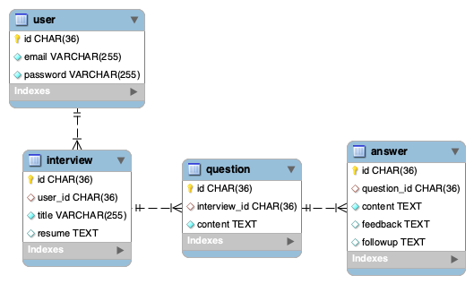

## Screenshots

---

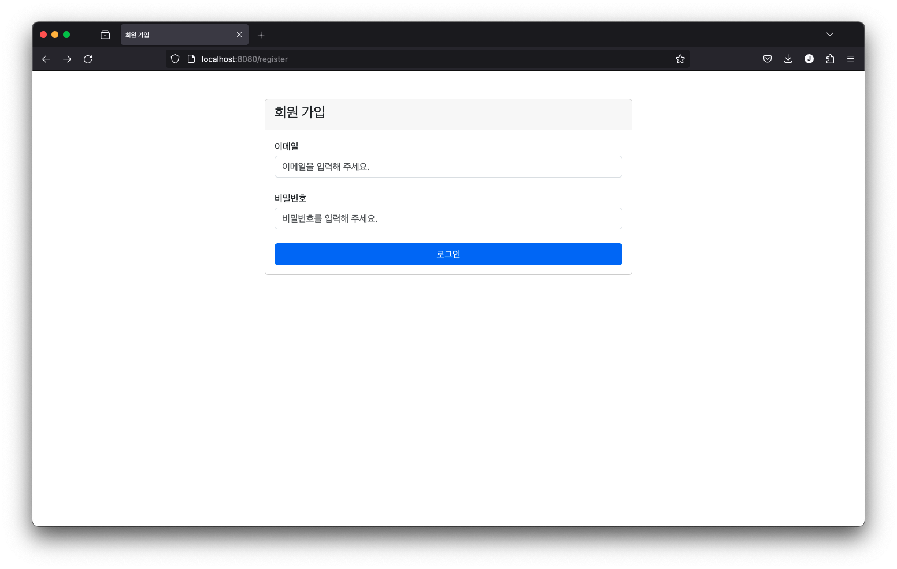

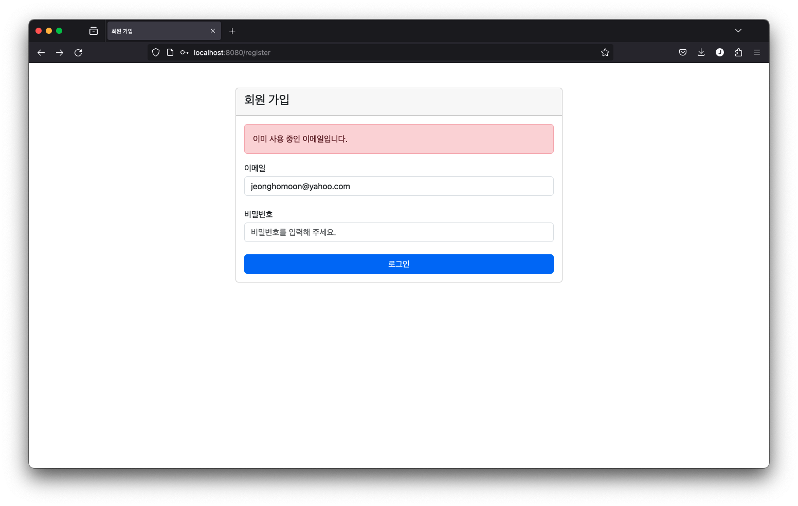

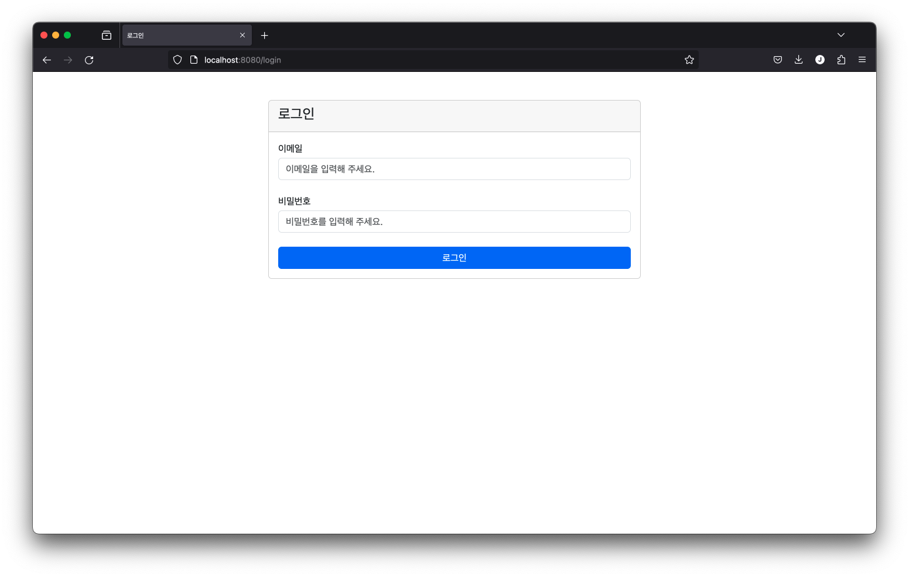

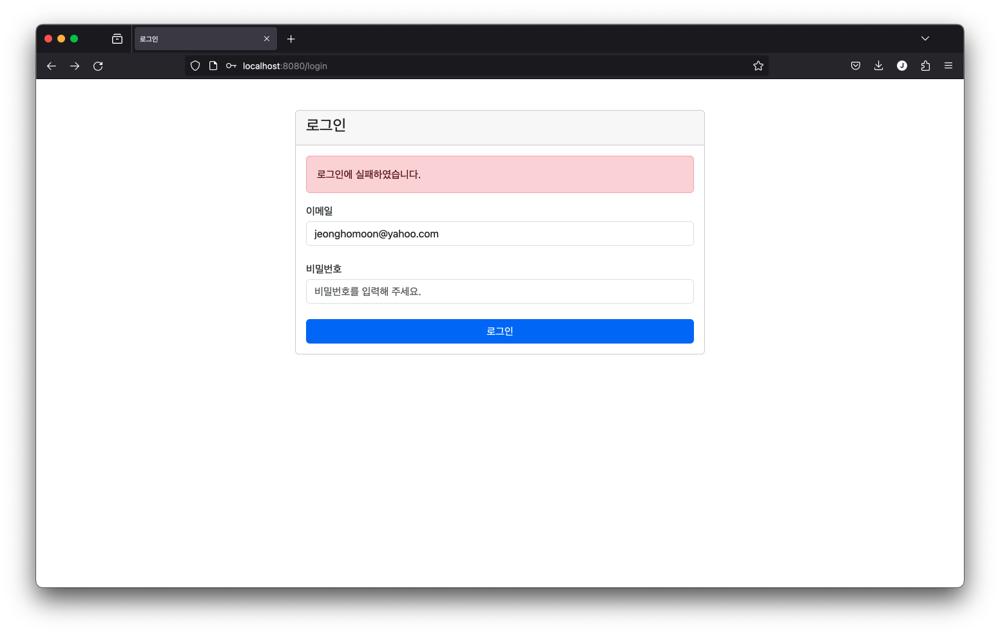

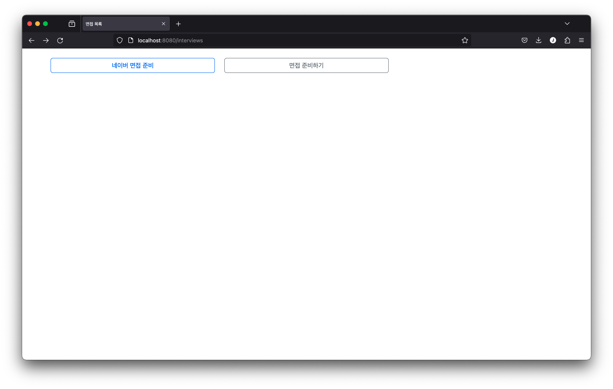

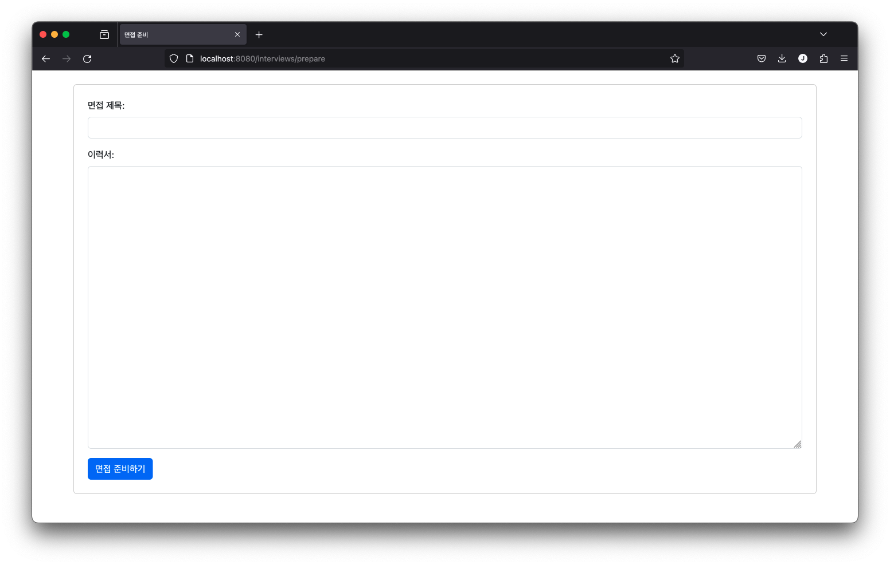

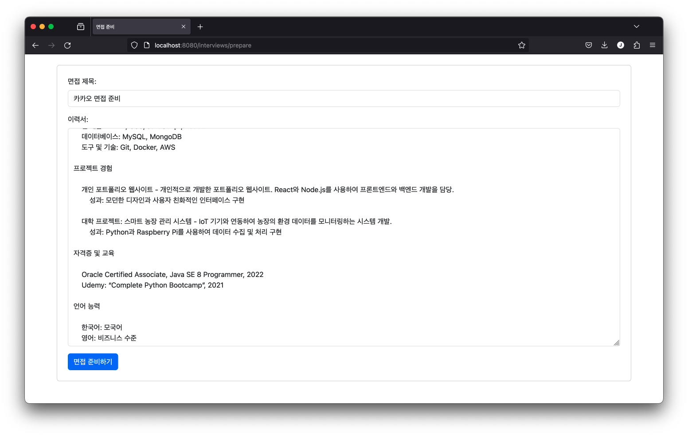

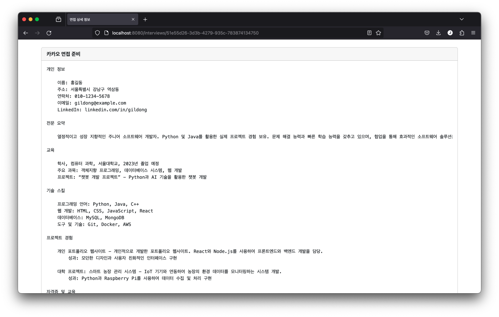

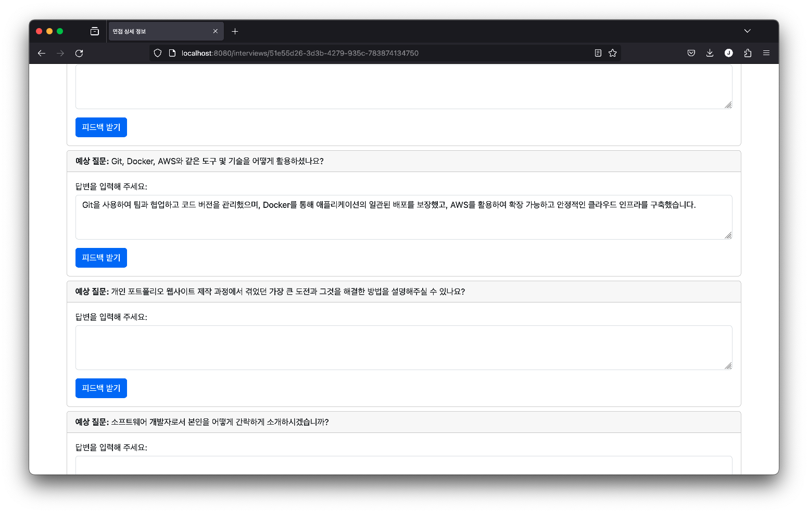

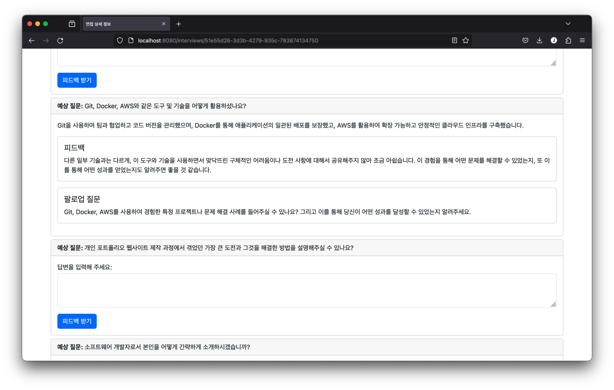

## Refereneces

---

- [카카오 채용 과정](https://careers.kakao.com/process)
- [네이버 채용 정보](https://recruit.navercorp.com/micro/teamnaver/tech)
- [매일 경제 기사](https://www.mk.co.kr/news/society/10684116)
